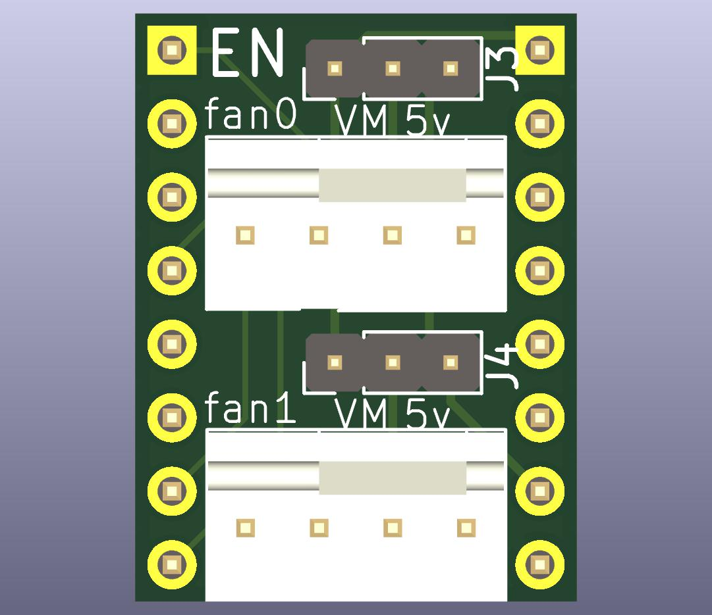

# TMTua

A drop-in fan connector for your Quiet Storm.



TMTua is smallish board with a single purpose: to connect a 4 pin (Noctua) fan
to your printer pcb without having to crimp a custom cable ever again.

## Features

- 3/4 pin fan connector
- No soldering required
- Voltage selection jumper (5V or Motor Voltage)

## Usage

1. Install the TMTua in a spare stepper driver slot on your printer pcb. Make
   sure the orientation is correct by aligning the top silk screen that says
   "EN" with the stepper driver slot's enable pin. If you install this
   backwards, bad things™ will happen.
2. Connect the fan to the TMTua using the 4 pin connector.
3. Set the voltage jumper to the desired voltage (5V or Motor Voltage). There is
   no buck on board, so if you have a 24V printer, you CANNOT use a 12V fan.
4. Match your stepper slot's pin numbers to the TMTua's pin numbers using the
   following table and your PCB's schematic/pinout diagram in your printer
   firmware.

| TMTua Pin | Stepper Driver Pin |
| --------- | ------------------ |
| fan0      |                    |
| tach0     | EN                 |
| tach1     | UART[^1]           |
| fan1      |                    |
| pwm0      | STEP               |
| pwm1      | DIR                |

## Example Klipper Configuration

```
[fan_generic fan_1]
pin: PA1
tachometer_pin: ^PD8
```

## Tachometer Pull-ups

You can use the
[Noctua white paper](https://noctua.at/pub/media/wysiwyg/Noctua_PWM_specifications_white_paper.pdf)
to assess whether the onboard pull-up if there's already one on the EN pin is
sufficient for the tach pins and your fans.

The paper outlines the following **minimum** recommendations:

| Voltage | Pullup Resistor(Ω) |
| ------- | ------------------ |
| 5V      | 1k                 |
| 12V     | 2k7                |
| 24V     | 12k                |

For example, the internal pull-ups on STM32F407 are about 40k which are
sufficient for all cases, but the hardware 10k pull-up on EN on my Robin Nano v3
board is too strong for a 24v fan, though fine for 5 and 12v fans.

## Schematic


## Where Do I Get One?

You can order the board from [JLCPCB](https://jlcpcb.com) using the
[production_files](jlcpcb/production_files) directory.

They're also available on my [here](https://octule.com).

[^1]: May not be wired on older boards. On newer boards, you may need to jumper
the UART pin under the stepper driver slot to connect it to your mcu. Consult
your board's schematic for more information.
